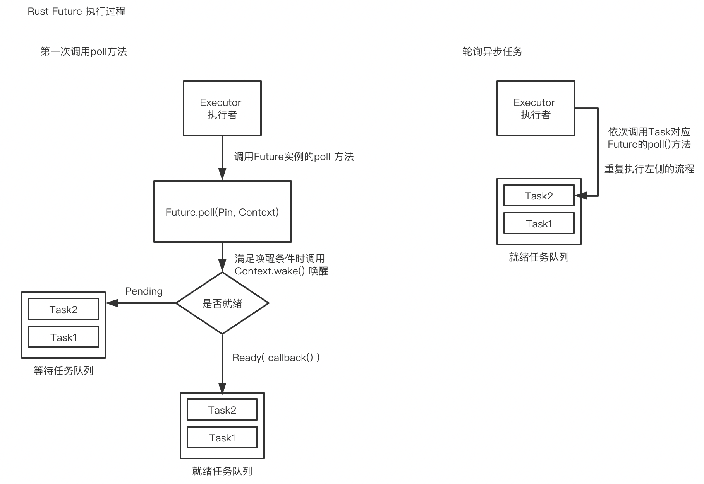

# Rust - 异步编程


## 该章节包含以下内容
* 异步
* async/await
* Future
* Pin固定
* Stream 特质
* 总结


## 异步

异步代码能让我们在同一个系统线程上并发执行多项任务，如果用多线程来实现并发执行多项任务，会有线程切换和跨线程共享数据产生额外开销。

Rust 的 async/await! 可以实现执行多个任务的目标而不用创建多个线程。

在一个线程内并发同时下载不同的网页，不需创建多个线程，例如：
```
async fn get_two_sites() {
    // Create a two different "futures" which, when run to completion,
    // will asynchronously download the webpages.
    // 创建两个不同的 future，当它们被完成执行时会异步下载不同的网页
    let future_one = download_async("https:://www.baidu.com");
    let future_two = download_async("https:://www.baidu.com");

    // 同时执行两个 future 使它们完成
    join!(future_one, future_two);
}
```
在 Rust 中，`async fn` 会创建一个异步函数，当它被调用时，会返回一个需要依次执行函数体来完成的 future 对象。

## async/await

`async/.await` 是 Rust 语言用于编写像同步代码一样的异步函数的内置工具。

要创建异步函数，可以使用 async fn 语法：
```
async fn do_something() { ... }
```

async fn 返回的值是一个 Future，需要在执行者上运行才能起作用：
```
use futures::executor::block_on;

async fn hello_world() {
    println!("hello, world!");
}

fn main() {
    let future = hello_world(); // Nothing is printed
    block_on(future); // `future` is run and "hello, world!" is printed
}
输出：
hello, world!
```

`use futures::executor::block_on;` 需要 Cargo.toml 添加 futures 依赖

```
[dependencies]
futures = "0.3"
```

调用 `block_on` 阻塞函数会阻塞整个线程，但阻塞的 Futures 将让出线程控制权，允许其他 Futures 运行。

在 async fn 中，你可以使用 .await 等待另一种实现 Future 特性的类型完成，与 block_on 不同，.await 不会阻止当前线程，而是异步等待 Future 完成，如果 Future 无法取得进展，则允许其他任务运行。

下面来看一个简单地例子，假设我们有三个 async fn：learn_song，sing_song 和 dance：
```
async fn learn_song() -> Song { ... }
async fn sing_song(song: Song) { ... }
async fn dance() { ... }
```

阻塞的实现方式：

```
fn main() {
  let song = block_on(learn_song());
  block_on(sing_song(song));
  block_on(dance);
}
```

非阻塞的实现方式：
```
async fn learn_and_sing() {
    // 在唱歌之前等待学歌完成
    // 这里我们使用 `.await` 而不是 `block_on` 来防止阻塞线程，这样就可以同时执行 `dance` 了。
    let song = learn_song().await;
    sing_song(song).await;
}
 async fn async_main() {
    let f1 = learn_and_sing();
    let f2 = dance();
    // `join!` 类似于 `.await` ，但是可以等待多个 future 并发完成
    // 如果学歌的时候有了短暂的阻塞，跳舞将会接管当前的线程，如果跳舞变成了阻塞
    // 学歌将会返回来接管线程。如果两个futures都是阻塞的，
    // 这个‘async_main'函数就会变成阻塞状态，并生成一个执行器
    futures::join!(f1, f2)
}
 fn main() {
    block_on(async_main());
}
```

下面是一个完整的例子：
```
use futures::executor::block_on;
async fn learn_song(song:&String) {
    println!("I am learn song {}", song);
}

async fn sing_song(song: &String) {
    println!("song is {:?}", song);
}

async fn dance() {
    println!("I am dancing");
}

async fn act() {
    let song = String::from("love");
    println!("111111");
    learn_song(&song).await;
    println!("222222");
    sing_song(&song).await;
    println!("333333");
    dance().await;
    println!("444444");
}

fn main() {
    block_on(act());
}
输出：
111111
I am learn song love
222222
song is "love"
333333
I am dancing
444444
```
`.await` 必须在 `async fn` 函数或代码块里才能执行。


async/ await! 是 Rust 语法的特殊部分，可以控制当前线程而不阻塞，允许其他代码在等待操作完成时取得进展。

async 有三种主要的使用方法：async fn，async块和 async闭包。每个返回一个实现 Future 特征的值：

```
// `foo()` returns a type that implements `Future<Output = u8>`.
// `await!(foo())` will result in a value of type `u8`.
async fn foo() -> u8 { 5 }

fn bar() -> impl Future<Output = u8> {
    // This `async` block results in a type that implements
    // `Future<Output = u8>`.
    async {
        let x: u8 = await!(foo());
        x + 5
    }
}

fn baz() -> impl Future<Output = u8> {
    // This `async` closure, when called, returns a type that
    // implements `Future<Output = u8>`
    let closure = async |x: u8| {
        await!(bar()) + x
    };
    closure(5)
}
```
async 和其他 Future 是懒惰的：它们在运行之前什么都不做。运行 Future 的最常见方式是 await! 它。当在 Future 上调用 await! 时，它将尝试运行以完成它。如果 Future 被阻止，它将让出当前线程。

### async 生命周期

async fn 与传统函数不同，带引用或其他非'static 参数的，返回一个受参数生命周期限制的 Future。

```
// This function:
async fn foo(x: &u8) -> u8 { *x }

// Is equivalent ot this function:
fn foo<'a>(x: &'a u8) -> impl Future<Output = ()> + 'a {
    async { *x }
}
```
这意味着从 async fn 返回 Future 必须 await!，因为 async fn 函数只有被调用了才执行，常见情况中，在调用函数之后立即 await! 执行它（如：await!(foo(&x))），但这样在多线程下会有问题。

将带有引用作为参数的 async fn 转换为'static Future 的一个常见解决方法是将参数与对块 async fn 调用捆绑在一起放进 async 块内：
```
async fn foo(x: &u8) -> u8 { *x }

fn bad() -> impl Future<Output = ()> {
    let x = 5;
    foo(&x) // ERROR: `x` does not live long enough
}

fn good() -> impl Future<Output = ()> {
    async {
        let x = 5;
        await!(foo(&x))
    }
}
```

### async move

`async move` 块将获取它引用变量的所有权 ，跟`闭包 move` 一样。

```
fn foo() {
    let my_string = "foo".to_string();
    async move {
        println!("{}", my_string);
    }
}
```


## Future 

Rust异步编程中最核心的Trait是std::future::Future，其定义如下:
```
// std::future::Future  Future trait 的定义
pub trait Future {
    type Output;
    fn poll(self: Pin<&mut Self>, cx: &mut Context) -> Poll<Self::Output>;
}

// std::task::Poll  枚举型的 Poll , Future trait的返回值类型 
pub enum Poll<T> {
    Ready(T),
    Pending,
}
```

`Future` 执行流程如下图：



1、用户通过手动展开或组合子的形式，创建了一个顶层的Future实例，其内部直接或间接调用了很多Future（直到此时，这些Future还没有被执行）；

2、用户将该Future丢进一个标准库外实现的Executor；

3、Executor创建一些环境信息并与该Future实例绑定，我们将环境信息和Future实例的整体称为Task。

4、立即调用一次该Future的poll方法，很快该方法执行完成，返回Poll::Pending

5、Executor将该task放入等待队列

6、某个时间点，该task被唤醒，将该task放入就绪队列

7、按顺序取出就绪队列中的task，依次调用每个task对应Future的poll方法，若仍然返回Poll::Pending，返回步骤5，若返回Poll::Ready(XXX)，则将结果返回给最终用户

std::task::Context类型基本等价于std::task::Waker类型

对于Future的实现者来说，可以通过Waker通知Executor，其所在的Task目前已经处于就绪状态，可以再次被调用poll方法。


### Executor 

Executor 可以认为是一个用来执行 future 的地方，我们可以在当前线程里面执行 future，也可以将 future 扔到一个 thread pool 里面去执行，也可以在 event loop 里面（例如 tokio-core）里面去执行。

而 Task 则可以认为是一种正在或者将会被执行的 future。通常，我们会将多个 future 组合成一个大的工作单元，然后会在 executor 上面 spawn 一个对应的 task。Executor 会负责当通知到来的时候，去 poll future，直到 future 全被执行结束。

整个流程可以简化为：

1、当一个 future 不是 ready 的时候，我们使用 task::current() 函数得到一个 task handle，并 block 住当前的 future。

2、 将 task handle 加入到一个感兴趣的事件队列里面，如果相关事件触发了，则通过 task.notify() 通知对应的 executor。

3、Executor 继续 poll future。


建议看另一篇文章，对future 异步介绍更详细一些 [Rust – Future 与异步](https://snowstar.org/2019/11/30/rust-future-async-and-await/)

对于 Task 的理解，建议看这篇文章，[Rust Async: async-task源码分析](https://zhuanlan.zhihu.com/p/92679351)


## Pin固定

假设P是一个指针类型，那么 `Pin<P>` 是对指针类型的约束，防止拿到指针指向对象的&mut 引用。
```
1. T ：Unpin时，约束失效， Pin<Box<T>> === Box<T>, Pin<&mut T> === &mut T.
2. 另外Pin本身也是一个类型，不管T是不是Unpin，都有Pin<Box<T>>: Unpin，Pin<&mut T> : Unpin.
```

为了对 futures 进行轮询，必须使用名为` Pin<T> `的特殊类型固定它们。

Pin 类型保证指针背后的值将不被移动。例如 Pin<&mut T>，Pin<&T>， Pin<Box<T>> 都保证 T 不会移动。

建议看这篇文章，分析比较全面 [Rust Async: Pin概念解析](https://zhuanlan.zhihu.com/p/67803708)


## Stream 特质

Stream 它表示的是一系列 Future 事件依次发生，构成一个流。我们可以不断的从这个流中取出正确的执行结果，或者暂停这个流，直到终结。

Stream 特质类似于 Future，但可以在完成之前得到多个值，类似于标准库的 Iterator 特质：
```
trait Stream {
    /// The type of value yielded by the stream.
    type Item;

    /// Attempt to resolve the next item in the stream.
    /// Returns `Poll::Pending` if not ready, `Poll::Ready(Some(x))` if a value
    /// is ready, and `Poll::Ready(None)` if the stream has completed.
    fn poll_next(self: Pin<&mut Self>, lw: &LocalWaker)
        -> Poll<Option<Self::Item>>;
}
```

与同步 Iterators 类似，有许多不同的方法可以迭代和处理 Stream 中的值。有组合子式的方法，如 map，filter 和 fold，和 try_map，try_filter 和 try_fold。

```
use futures::prelude::*;

let fut = async {
    let mut stream: impl Stream<Item = Result<i32, io::Error>> = ...;

    // processing with `try_for_each`:
    await!(stream.try_for_each(async |item| {
        // handle `item`
        Ok(())
    }))?;

    // processing with `while let`:
    while let Some(item) = await!(stream.try_next())? {
        // handle `item`
    }

    ...

    Ok(())
};
```

不幸的是，for 循环不能用于 Streams。

要同时处理流中的多个项，请使用 for_each_concurrent 和 try_for_each_concurrent 方法。

```
use futures::prelude::*;

let fut = async {
    let mut stream: impl Stream<Item = Result<i32, io::Error>> = ...;

    await!(stream.try_for_each_concurrent(MAX_CONCURRENT_JUMPERS, async |num| {
        await!(jump_n_times(num))?;
        await!(report_jumps(num))?;
        Ok(())
    })?;

    ...
    Ok(())
};
```

建议看这篇文章，会有更详细的介绍  [Rust流(Streams)](https://zhuanlan.zhihu.com/p/70247995)


## 总结

对Rust的异步理解关键是对 Future trait 的执行原理和过程的理解，包括 Waker、Task、Executor的协同和分工，Rust异步编程体验比较友好，没有嵌套回调，可以用同步的方式来写异步程序。 

可扩展阅读 [Rust 与服务端编程的碎碎念](https://zhuanlan.zhihu.com/p/30028047)